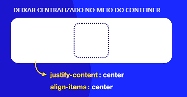

# Eixos e direções

## **Configurações Importantes**

``` Flex Direction
flex-direction: row;
----------------->
flex-direction: row-reverse;
<----------------
flex-direction: column; e -reverse;
(baixo / cima)respectivamente
```
### Eixo principal

main start / main end

|------------------|
> _~~main axis~~--->_ 
---
### Cross principal (Eixo y)

>cross axis, cross start e end

---

### Flex Direction


---

### Flex Wrap

``` 
nowrap > tenta encolher e não quebra

wrap > quebra pro sentido do cross-axis

wrap-reverse > quebra no sentido oposto do cross-axis
```
__*Ele muda dependendo do sentido do*__
> flex-direction

#### flex-wrap: wrap
 

#### flex-wrap: wrap-reverse


---

### Flex Flow

#### flex-flow: (direção) -> row (quebra) -> nowrap;

>flex-flow: row wrap-reverse;

---

### Justify Content

#### Space-


---

### Centralizar item no conteiner

